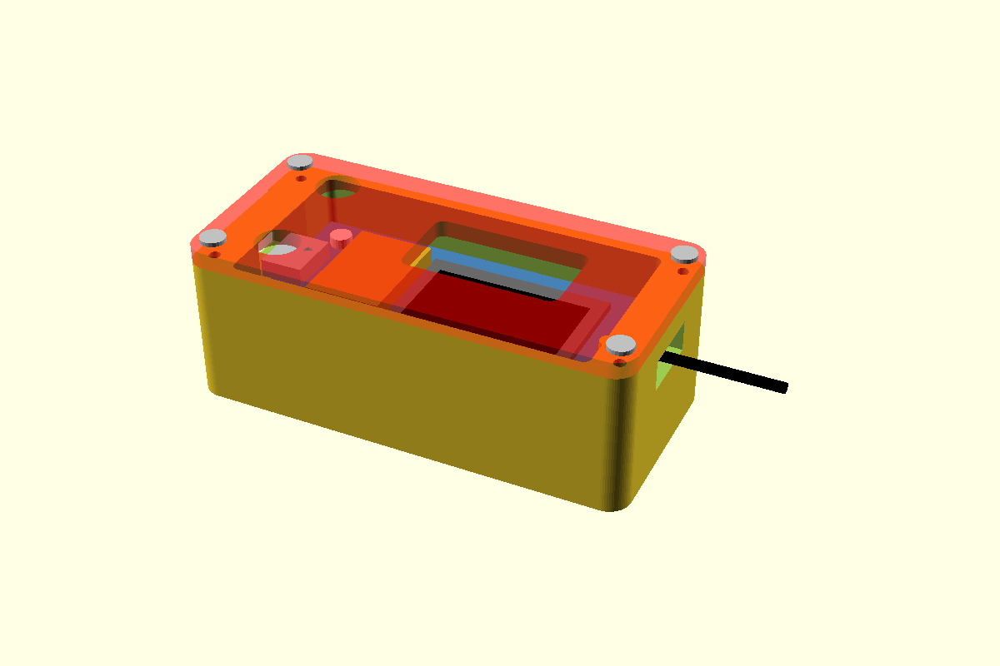

# UAV-BOS Mesh-Repeater

LoRa-Repeater für die [UAV-BOS-Tracker](https://github.com/denni95112/uav-bos-hardware-tracker).
Er sendet keine eigene Position und hat kein GPS.
Er leitet die Funkpakete der Tracker weiter, mit demselben Meshtastic-kompatiblen Protokoll
wie die Tracker-Firmware.

- Tracker: [uav-bos-hardware-tracker](https://github.com/denni95112/uav-bos-hardware-tracker)
- Hardware: Heltec **WiFi LoRa 32 V2**, 868 MHz (ESP32, SX1276, OLED)
- Firmware: PlatformIO + Arduino (`src/`)
- Gehäuse: OpenSCAD (`case/repeater_case.scad`), Druckdateien `case/base.stl` und `case/lid.stl`

Die 433-MHz- und 915-MHz-Varianten des Boards passen nicht. Das Frequenzband ist fest EU 868.

> **Firmware ganz einfach aufspielen:** Repeater per Micro-USB anschließen und auf
> [ubhtwf.open-drone-tools.de](https://ubhtwf.open-drone-tools.de/?board=repeater) auf **Installieren** klicken.
> Das funktioniert direkt im Browser (Google Chrome oder Microsoft Edge am PC), ohne Software-Installation.

## Betriebsarten

| Betriebsart | WLAN | LoRa |
|-------------|------|------|
| Repeater + WLAN | nur Config-AP, kein Router | leitet weiter |
| Repeater ohne WLAN | aus | leitet weiter |

Der Access Point heißt **`UAV-BOS-Repeater-XXXX`**. Die Seite ist `http://192.168.4.1`.
Beim ersten Start ist "Repeater + WLAN" aktiv, damit sich das Gerät einrichten lässt.

- **PRG kurz**: Betriebsart wechseln. Die Auswahl gilt 3 Sekunden nach dem letzten Druck.
- **PRG 3 Sekunden**: OLED an oder aus. Der Funk läuft weiter.

Aus "Repeater ohne WLAN" kommt man mit einem kurzen Tastendruck zurück zum Config-AP.

## Einrichtung

1. Repeater per Micro-USB an den PC (Datenkabel). Firmware im Browser aufspielen:
   [ubhtwf.open-drone-tools.de](https://ubhtwf.open-drone-tools.de/?board=repeater), **Installieren**.
   Falls kein Port erscheint: **PRG** halten, kurz **RST** drücken, **PRG** loslassen, erneut auf Installieren klicken.
   Alternativ mit PlatformIO, siehe [Bauen](#bauen).
2. Mit dem WLAN `UAV-BOS-Repeater-XXXX` verbinden und `http://192.168.4.1` öffnen.
3. Dieselben LoRa-Werte eintragen wie bei den Trackern:
   - Modemprofil (Standard LongFast)
   - Frequenz-Slot
   - Hop-Limit
   - Sendeleistung (2–17 oder **20 dBm**; 18 und 19 werden zu 17. Der Tracker-SX1262 darf 22)
   - Weiterleitung: "Alle Pakete", "Nur UAV-BOS-Tracker" oder "Keine"
   - Sendezeit für fremde Pakete
   - **Mesh-Schlüssel**, identisch zu den Trackern
4. Optional ein AP-Passwort (mindestens 8 Zeichen, Benutzer `admin`).
5. Speichern. Das Gerät startet neu.

Ohne denselben Schlüssel erkennt der Repeater den UAV-BOS-Kanal nicht. "Alle Pakete" leitet
fremde Meshtastic-Pakete trotzdem weiter. "Nur UAV-BOS-Tracker" braucht den Schlüssel.

Der Repeater schickt alle 15 Minuten ein Hello mit Hop 0, damit die Tracker ihn als eigenen
Relay erkennen. Das Hello wird nicht weitergeflutet.

## Funk

Gleiche Vorgaben wie die Tracker-Firmware:

- EU_868, Sync-Word `0x2B`, Präambel 16
- Profile ShortFast, ShortSlow, MediumFast, MediumSlow, LongFast, LongModerate, LongSlow
- 250-kHz-Profile senden auf 869,525 MHz. 125-kHz-Profile nutzen Slot 1 (869,4625 MHz) oder Slot 2 (869,5875 MHz)
- 10 % Sendezeit im Band 869,4–869,65 MHz. Fremde Pakete stoppen früher, Tracker-Pakete haben Vorrang
- Kanalname `UAV-BOS`

**Schlüssel in der Firmware (optional):** `MESH_PSK_B64` in `.env` (Vorlage `.env.example`) oder als
Umgebungsvariable. Ein Gerät ohne gespeicherten Schlüssel übernimmt ihn einmalig. Der Wert steht
lesbar in der Binärdatei. Solche Builds nicht veröffentlichen.

## Gehäuse (`case/repeater_case.scad`)

Für die Heltec WiFi LoRa 32 V2 und einen LiPo 35 × 20,1 × 6,5 mm. Der Akku liegt unter dem
Display-Ende, die Platine auf seitlichen Auflagen. Ohne Stiftleisten: eine gelötete Leiste ist
höher als der Deckel. Fertige Druckdateien liegen in `case/`: `base.stl` und `lid.stl`.

Außenmaße: 63,8 × 29,9 × 23,5 mm.



Die Öffnungen sind an einem V2-Board gemessen, ab der Platinenkante an der USB-Seite.
"Links" heißt: von oben gesehen, USB-Buchse zeigt zu dir.

| Parameter | Standard / Bedeutung |
|-----------|----------------------|
| `pcb_l`, `pcb_w` | 51 × 25,5 mm Platine |
| `bat_l`, `bat_w`, `bat_h` | 35 × 20,1 × 6,5 mm LiPo |
| `bottom_clear` | 4,8 mm Luft zwischen Akkuoberfläche und Platinenunterseite. Größer, wenn der Funkschirm den Akku berührt |
| `top_clear` | 7,0 mm über der Platinenoberseite für OLED und ESP32-Modul. Größer, wenn der Deckel auf das Display drückt |
| `oled_cx`, `oled_cy`, `oled_lx`, `oled_ly` | Displayfenster, Mitte ab USB-Kante und PRG-Kante |
| `prg_x`, `prg_y`, `rst_x`, `rst_y` | Tastenmitten. Das markierte Loch ist PRG |
| `usb_w`, `usb_h` | Micro-USB-Öffnung |
| `ant_w`, `ant_h` | Schlitz am Display-Ende für das U.FL-Antennenkabel |

Export:

```
openscad -o case/base.stl -D 'part="base"' case/repeater_case.scad
openscad -o case/lid.stl  -D 'part="lid"'  case/repeater_case.scad
```

`part="assembly"` zeigt das zusammengebaute Gerät mit Platine, Akku und Deckel.
`part="both"` legt Unterteil und Deckel nebeneinander zum Drucken.

Zusammenbau: Akku vom USB-Ende unter die beiden Lippen schieben und an der Buchse auf der
Unterseite einstecken. Platine gegen das Antennenende legen, Deckel aufsetzen und mit
4× M2×8 Zylinderkopfschrauben schließen. Die LoRa-Antenne führt durch den Schlitz am
Display-Ende nach außen. Das markierte Loch ist PRG (USB zeigt zu dir: links).

Druck in PETG oder PLA, 0,2 mm Schichthöhe, 3 Wände, keine Stützen. Der Deckel ist in der
STL schon kopfüber, die Oberseite liegt auf dem Druckbett.

## Bauen

```
pio run -e heltec_v2
pio run -e heltec_v2 -t upload
```
